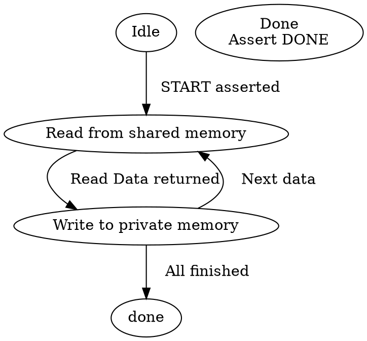
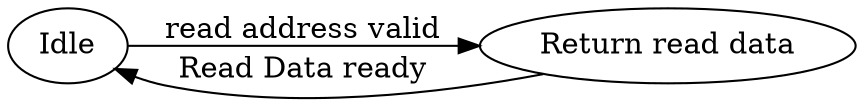
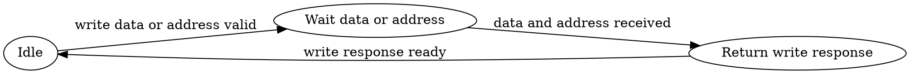

# <center> ACAL 2024 Curriculum Lab 11 <br /><font color="#1560bd">SOC Design Modules <br /> Bus Protocol and DMA Design</font></center>

###### tags: `AIAS Spring 2024`
[TOC]

# Todo

- [x] byte/half reading access in DataMem module using request `strb`

7/29
- [x] Introduction 補上 Lab 會用到的概念以及強調 address space design 存在的必要性以及原因

- [ ] Decoder 補充

- [ ] Mux 中的 arbiter 介紹

- [x] 修改 DMA example code 中 WH 寫反的問題

- [x] 移動 Memory-mapped I/O Interface 描述到 Homework 介紹

- [x] 修改 HW 11-1 架構圖

7/22
- [x] 增加文件描述
        (1) CPU用甚麼指令去寫入DMA
        (2) memory mapping 是怎麼讓CPU控制DMA的

- [x] Inst memory 掛在CPU, data memory 掛在bus

- [x] 更新 Hardware/src/main/resource 的檔案成 Convolution2D.S 相關的檔案

- [x] HW11-1 應限制 memory 為 high-latency 才能使 Hw11-4 的比較有意義

- [x] Template 關於要修改 assembly 的描述改到文件上

- [x] data.hex：1 Byte輸出改成4byte


# Introduction

 A Systems on Chip (SoC) is an IC that integrates multiple components of a system onto a single chip. This integration typically includes the CPU, GPU, memory interfaces, possible cellular communications methods, and other components onto a single die. SoCs have a variety of blocks that require sending data and instructions and thus require communication subsystems. For a while, traditional data bus architectures were used to connect the different blocks of the SoC.  For example, ARM’s royalty-free Advanced Microcontroller Bus Architecture (AMBA) was a common standard. However, computer buses have limited scalability and support only tens of cores. The fact that wire delay is not scalable and wire consumes lots of electrical power has led to adoption of network-on-chip (NoC) technology. 
  The design flow for an SoC aims to develop this hardware and software at the same time, also known as architectural co-design. A platform-based SoC design flow usually saves developers lots of time and cost to develop a SoC since devlopers can leverage many reusable components and tools in a mature SoC platform. 

  In this lab, we will focus on two basic design modules designed for the following requirements in a small-scale SoC including
- Inter-Module Communication
- Data Movement

With the CPU designed in earlier lab and the design components in this lab, we will be able to construct a simple SOC to solve many engineering problems in future lab. 

## Inter-Component Communication Designs in SoCs

### Address Space Design
In computing, an address space defines a set of address regions, each of which may correspond to a network host, peripheral device, disk sector, a memory cell or other logical or physical entity. In a SOC, all components are connected together via a bus or inteconnect architecture with multiple masters and slaves. All masters communicates with slaves that holds a specific portion in the address space. A master can communicate with a slave via unique addresses on a bus. Not all the masters can see the same address space. For example, a 32-bit CPU can access at most $2^{32}=4GB$ address region, whereas a 64-bit CPU can access at most $2^{64}B$ address region. As each master might sees different portions of a large address space, the bus protocol design needs to (1) support an address space that is large enough to accommodate all the slave address regions and (2) it might do address mapping and translation in some cases. 

Suppose we would like to construct a SoC as shown in the following diagram. 


CPU1 and CPU2 are both 32-bit CPU cores. The bus bridge connect the `Cluster1` SoC to the external world. The address space for the whole system might be larger than the CPU address space in a complicated chip design. In this case, we assume that the system address space is a 36-bit address space. Here is a list of components in the `cluster1` including 

- CPU1 & CPU2 : 32 bits address space
- Bus1 : 34 bits address space
- On-chip Scratchpad Memory : 128MB
- Off-chip DRAM : 16GB


In the above diagram, each bar represents the address space that the corresponding component sees. For example, each CPU needs to access local scratchpad memory and the off-chip DRAM. Therefore, in the CPU's 32-bit address region, it needs to include address regions corresponding to those two memories. For `Bus1`, if a CPU issues a request, it needs to know which slave to route to. Therefore, the bus's address region needs to include all slaves connected to the bus. In this example, the off-chip DRAM far exceeds the CPU's address region, so only a portion of the off-chip DRAM is accessible from both CPUs. Additionally, both `CPU1` and `CPU2` are connected to `Bus1`, whereas the off-chip DRAM is connected to the System Bus.  The address space definitions of `Bus1` and the system bus may be different. It is common to design a bus bridge to facilitate the transaction across different address spaces, including address and handshaking signal conversions. If the bus protocols are consistent and the address space is well-designed, address conversion will be easier. In this example, this conversion only requires the System Bus logic to prefix 4 0s to the left of the MSB bit and drop the first 4 MSB bits in the reverse direction. 


### Shared Bus vs Crossbar
**Shared bus** is a design that all masters and slaves uses a common bus. The chosen master broadcasts commands to any connected slave component, which requires the master to actively send an enable signal or requires the slave to accept the command by inspecting the bus signal. The following diagram depicts a simple example consisting of 4 agents, R0~R3, communicating through a single bus. Each agent has a master port to issue requests to the common bus and a slave port to accept requests from the common bus. 


This type of design has the following pros and cons. 
- **Pro**: Easy to implement, suitable for modules without bandwidth requirements.
- **Cons**: Master and slaves have to wait until the bus is free to initiate the next transmission, which greatly limits the performance.

**CrossBar** is a type of P2P(Point to Point) interconnect, which has dedicated control lines and data lines between each pairs of a master and a slave. The following figure shows a simple example of 4 masters ands 4 slaves. The shared bus is replaced by 4 independent data lines, and 4 additionals muxes for controlling.


Compared to the shared bus design, it has the following pros and cons:
- **Pro**: With high effective bandwidth, allow data transmission among multiple masters and slaves parallelly
- **Cons**: More complicated control logic to implement, suitable for modules with hight bandwidth requirements.

### Introduction to AMBA 

Advanced Microcontroller Bus Architecture (AMBA) is a bus architecture used in the design of system-on-chip (SoC). It's originally designed for ARM-based systems. However, it's widely adopted even in the non-ARM-based systems these days. It is categorized into two protocols under the shared bus architecture: Advanced High-Performance Bus (AHB) and Advanced Peripheral Bus (APB). AHB is responsible for connecting components such as embedded processors like CPU cores, DMA controllers, on-chip memory, and high-bandwidth devices. On the other hand, APB is mostly used to connect low-bandwdith peripheral components of the system. The protocol of APB is relatively simpler compared to AHB, and a bridge can be used to interface between AHB and APB in order to reduce the loading on the AHB.


### Advanced Peripheral Bus(APB)
APB is a shared bus protocol, where all slave components share control and data lines from the APB bridge. The APB bridge selects which slave to communicate with using `n` PSEL signals (where `n` is the number of slaves). Each APB Slave connect to the APB bridge via a single PSELx input signal (where `x` is the slave number). The diagram below illustrates the IO connections between the APB bridge and APB Slave.


#### Signal Discription

| Signal         | Description                                                                                                                                                        |
| -------------- | ------------------------------------------------------------------------------------------------------------------------------------------------------------------ |
| PSELx(1 bit)   | When the signal is asserted, it indicates that a request has been sent to the slave.                                                                               |
| PWRITE(1 bit)  | 0 : Read <br> 1 : Write                                                                                                                                            |
| PENABLE(1 bit) | This means that the current request has been enabled. Only when both the PSELx and PENABLE signals are asserted, will the slave complete the transaction response. |
| PADDR(32 bits) | Address                                                                                                                                                            |
| PWDATA         | Write data                                                                                                                                                         |
| PRDATA         | Read data                                                                                                                                                          |

#### Operation of APB
The operation of APB is straightforward. When a master selects a slave, it first pulls its dedicated PSELx signal high. Before the next cycle, it places data on the data lines and waits for the slave to respond with PREADY. You can refer to the state diagram and state descriptions below for more details.

| State  | Description                                                                                                                                                                                                                                                                                                                                                                                                         |
| ------ | ------------------------------------------------------------------------------------------------------------------------------------------------------------------------------------------------------------------------------------------------------------------------------------------------------------------------------------------------------------------------------------------------------------------- |
| IDLE   | The default state of APB  |
| SETUP  | When a transaction occurs, the PSELx corresponding to the target slave is set to 1, and the system transitions to the ACCESS state.  |
| ACCESS | PENABLE is set to 1 in this state. During this state, control signals (PADDR, PWRITE) cannot be changed. When PREADY = 0, it indicates that data writing or reading has not yet been completed. When PREADY = 1, it indicates that data writing or reading has finished. Based on whether a transaction has occurred at this point, the system decides whether to transition to the IDLE state or the SETUP state. |

::: info
**Note : The occurrence of a transaction means that a request has been sent to the slave, and this is dependent on the state of the PSELx signal.**
:::


To support higher bandwidth requirement modules, ARM first came out with AHB, and later on a brand new protocol called AXI. In contrast with APB, AXI is a P2P(Point-to-Point) crossbar design with 5 independent channels operating on read and write. The details of AXI will be introduced in the next section.

### Introduction to AXI Lite
 
In this section, we will introduce the concept of AXI4-Lite protocol. Compared to the original AXI4, AXI4-Lite is more streamlined and has a simpler interface. In Lab 11-1, we will demonstrate the AXI4-Lite protocol implementation with a configuration of 1 master and 2 slaves attached to the bus. 

:::danger
The AXI-Lite bus protocol makes two simplifying assumptions compared to AXI:

1. Each transition has a burst length of 1.

2. The size of data carried by each transfer is equal to the bandwidth of the data bus.

These two assumptions combined mean that the data size carried by a single request from the master is equal to the data bus width. Due to these assumptions, if the data size of the read/write request exceeds the bandwidth of the data bus, the master and slave must coordinate when sending and receiving the request/data. For example, requests larger than the bandwidth of the data bus must be split into multiple requests for transmission. Additionally, when receiving, these requests may take multiple cycles to complete. For requests smaller than the data bus width, writing data relies on the WSTRB signal in the write data channel for masking.
:::

#### AXI4-Lite Interface Signals

The AXI-Lite interface comprises five channels, including the Read Address, Read Data, Write Address, Write Data, and Write Response. The control signals for each of these five channels are illustrated in the following diagram.


#### Handshake Process

In AXI4-Lite, the handshake process is achieved using the `VALID` and `READY` signals. When the sender has prepared the data (ADDR, DATA, RESP) and is ready to transmit, it asserts the `VALID` signal to indicate that the data is valid. On the receiving end, the `READY` signal is used to indicate whether it is ready to accept data. When both `VALID` and `READY` are set to 1 simultaneously, the handshake is completed. Now, let's proceed with an explanation of the AXI4-Lite read/write process.

#### Signal Description

This section describes a simplified version of the AXI4-Lite Interface for reference. There are five channels and each channel has multiple unidirectional signals as shown in the following tables. 
  
- __Global Signals__

| Signal  | Direction       | Description                     |
| ------- | --------------- | ------------------------------- |
| ACLK    | M$\rightarrow$S | Clock signal.                   |
| ARESETn | M$\rightarrow$S | Global resetsource, active low. |

- __Read Address Channel__

| Signal  | Direction       | Description                                                                                              |
| ------- | --------------- | -------------------------------------------------------------------------------------------------------- |
| ARADDR  | M$\rightarrow$S | Read address, usually 32-bit wide.                                                                       |
| ARVALID | M$\rightarrow$S | Read address valid. Master generates this signal when Read Address and the control signals are valid.    |
| ARREADY | S$\rightarrow$M | Read address ready. Slave generates this signal when it can accept the read address and control signals. |


- __Read Data Channel__

| Signal | Direction       | Description             |
| ------ | ---------       | -----------             |
| RDATA  | S$\rightarrow$M  | Read Data (32-bit only) |
| RESP   | S$\rightarrow$M  |Read response. This signal indicates the status of data transfer.|
| RVALID | S$\rightarrow$M  | Read valid. Slave generates this signal when Read Data is valid|
| RREADY | M$\rightarrow$S | Read ready. Master generates this signal when it can accept the Read Data and response.|

The above two tables include a minimum set of channel signals for read transactions on an AXI4-Lite bus. We only include signals that are required in the AXI4-Lite Read transactions. Please refer to the [AXI4-Lite Interface](https://www.realdigital.org/doc/a9fee931f7a172423e1ba73f66ca4081) in the reference material for a complete set of signals in each channel.

Previously, we mentioned that AXI4-Lite uses a handshake process for data processing, where a pair of VALID  and READY signals is used to confirm the request being sent out at the master side and being accepted at the slave side. The `VALID` signal indicates whether the data is ready to be placed on the data line, while the `READY` signal indicates that the receiver is ready to accept the data. When both signals are high, a transaction is acknowledged by both the master and the salve. 

- __Write Address Channel__

| Signal  | Direction       | Description                                                                                           |
| ------- | --------------- | ----------------------------------------------------------------------------------------------------- |
| AWADDR  | M$\rightarrow$S | Write address, 32-bits wide                                                                           |
| AWVALID | M$\rightarrow$S | Write address valid. Master generates this signal when Write Address and control signals are valid    |
| AWREADY | S$\rightarrow$M | Write address ready. Slave generates this signal when it can accept Write Address and control signals |

- __Write Data Channel__

| Signal | Direction       | Description                                                                                                             |
| ------ | --------------- | ----------------------------------------------------------------------------------------------------------------------- |
| WDATA  | M$\rightarrow$S | Write data (32-bit only).                                                                                               |
| WSTRB  | M$\rightarrow$S | Write strobes. 4-bit signal indicating which of the 4-bytes of Write Data. Slaves can choose assume all bytes are valid |
| WREADY | S$\rightarrow$M | Write ready. This signal indicates that the slave can accept the write data.                                            |
| WVALID | M$\rightarrow$S | Write valid. This signal indicates that valid write data and strobes are available.|

- __Write Response Channel__

| Signal | Direction       | Description                                                                                    |
| ------ | --------------- | ---------------------------------------------------------------------------------------------- |
| BRESP  | S$\rightarrow$M | Write response. This signal indicates the status of the write transaction.                     |
| BVALID | S$\rightarrow$M | Write response valid. Slave generates this signal when the write response on the bus is valid. |
| BREADY | M$\rightarrow$S | Response ready. Master generates this signal when it can accept a write response               |

In AXI-Lite, the size of the write data is always the same as the bandwidth (for example, 4 bytes) in size. Therefore, if you have less than 4 bytes of write data to send, you need to use the `WSTRB` (Write Strobe) signal to represent data masking. If you have more than 4 bytes of data to send, the master needs to break the request into multiple 4-byte requests for transmission. This ensures that the data aligns with the 4-byte boundary, as required by AXI-Lite.

In the subsquent two subsections, we will explain how Read and Write transactions are carried out in the AXI4-Lite protocol. 
#### AXI4-Lite Read Transaction

1. Suppose a master wants to read data from a slave. The Master starts with providing the source address in the read address channel. When a master asserts `ARVALID`, it waits for the slave's `ARREADY` signal to be asserted to complete the acceptance of the read request at the slave side. 

2. When the `ARREADY` signal is asserted by the slave, the handshake for the read address channel is completed, ensuring that the slave has received the correct read address.

3. After the slave has received the read ddress, it will read the data at that address, and asserts the `RVALID` signal to indicate that the data is ready in the read channel, waiting for the master to assert the`RREADY` signal to complete the acceptance of the read data response.

4. If the `RREADY` signal is asserted early in the diagram, it means that the master is ready to receive the read data response. The handshake for the read data channel is completed after `RVALID` is asserted.


#### AXI4-Lite Write Transaction

:::info
- Please refers to [AXI4-Lite Interface](https://www.realdigital.org/doc/a9fee931f7a172423e1ba73f66ca4081) for more details
:::
1. The master places an address on the write address channel and data on the write data channel. At the same time it asserts `AWVALID` and `WVALID` indicating the address and data on the respective channels are valid. `BREADY` is also asserted by the master, indicating it is ready to receive a write response.
2. The slave asserts `AWREADY` and `WREADY` on the write address and write data channels, respectively. They might be asserted at the same cycle or different cycles. 
3. Since the`Valid` and `Ready` signals are present on both the write address and write data channels, the handshakes on those channels take place. The associated `Valid` and `Ready` signals are deasserted in the subsequent cycle. 
4. The slave asserts `BVALID`, indicating there is a valid reponse on the write response channel. (in this case the response is 2’b00, which denotes ‘OKAY’).
5. The next rising clock edge completes the transaction, with both the `Ready` and `Valid` signals on the write response channel high.


:::danger
**Note**
1. For write transactions, addresses and data do not have a fixed order or relationship. The address channel's valid signal and the data channel's valid signal can be high at the same time or in any order.

2. The valid and ready signals for the same channel represent the states of the sender and receiver, respectively. There is no interdependence between the signals.
:::

## Data Movement in SoCs

### Introduction to Decoder

When data needs to be transferred over a shared bus, the source component also sends the destination component's address. In an address-mapped design, each component has a designated address map (a specific range of addresses). A decoder is responsible for interpreting the address and selecting the correct destination component to receive the data. Decoding can be implemented either in a centralized or a distributed manner.

Figure 2.5 (a) illustrates a centralized decoder implementation. This decoder receives the address of a data transfer from a master component and then sends a select signal to the relevant slave component, indicating that data should be read from or written to it. One benefit of this centralized approach is its flexibility; adding new components to the system requires minimal modifications, making it easily extendable.


 Another decoder implementation is the distributed decoding, depicted in Fig. 2.5 (b). In this scheme, each slave component has its own separate decoder. When the master transmits the address on the shared bus, every slave interface’s decoder interprets the address to determine if the data transfer is intended for it. This distributed approach has the advantage of needing fewer signals compared to the centralized method, which requires additional signals to connect the centralized decoder to every slave on the bus. However, the distributed scheme involves more hardware duplication since each slave must decode the address individually, whereas a single decoder does this in the centralized approach. Consequently, distributed decoding typically demands more logic and occupies more space. Furthermore, adding new components to the bus or altering the address map may necessitate changes in the decoders at each slave interface.


### Introduction to Arbiter

On a shared bus, it is possible for two or more masters to try to initiate a data transfer simultaneously. Since the shared bus can only manage one data transfer at a time, an arbitration mechanism is necessary to decide which master gets to proceed and which must wait. An arbiter is the component responsible for making this decision, using specific criteria to determine which master can access the bus when multiple masters request access at the same time. The arbiter's arbitration scheme decides if a master is allowed to access the bus. 

Same as the decoder, an arbiter can be implemented either centralized or distributed manner. Figure 2.5 (a) shows the case of an arbiter implemented in a centralized configuration, while Fig. 2.5 (b) shows the arbiter in a distributed configuration. The trade-offs for the two schemes are the same as for the decoder.

In bus-based communication architectures, several common arbitration schemes are used to manage access to the bus. Key requirements for an arbitration scheme include ensuring fair access, prioritizing critical data transfers, and preventing starvation scenarios.

**static priority (SP)** arbitration scheme is the most commonly used scheme, where each master is assigned a fixed priority. The master with the highest priority always gains bus access. The SP scheme can be either preemptive or non-preemptive. In a preemptive implementation, an ongoing lower-priority transfer is immediately halted if a higher-priority request comes in. In a non-preemptive implementation, the lower-priority transfer is allowed to finish before the bus is handed over to the higher-priority master. Although the SP scheme is easy to implement and can optimize performance by prioritizing critical transfers, such as between processor and memory, however, it can lead to starvation for lower-priority masters if higher-priority requests are frequent. 

To avoid this, the **round-robin (RR)** arbitration scheme is used, which grants bus access in a cyclic manner to all masters, ensuring that every master eventually gets bus access. However, in critical data transfers, the RR scheme may introduce delays as each master must wait for its turn.


### Introduction to DMA

Direct Memory Access (DMA) is a process of transferring data from one memory location to another without the direct involvement of the processor (CPU).There are many different types of DMA implementations, some of them for very specific use cases. In this lab, we will focus on a generic and simplified design commonly seen in many SoCs.

DMA is used for moving data at one memory location to another. When used properly, it can improve the efficiency of the system. The CPU can be more focused on performing calculations, without having to waste too many instruction cycles for transferring data. This can result in improving the speed of our program.

<br/>


Next, let's discuss how to design a Direct Memory Access (DMA) controller. First, we need to define how the CPU and DMA communicate with each other. One approach is to have a dedicated interface and use interrupts for communication between the CPU and DMA. However, this would require an interrupt controller within the CPU to support such a design. In this lab, we employ a simplified approach that utilizes the concept of memory-mapped registers. This way, the CPU can use load and store operations to write information (DMA instructions) into the DMA. The registers are mapped to an address location in a memory-mapped address space. We need to define the format of these registers, which is the programming interface of the DMA engine. In this lab, we will demonstrate how to design an AXI-Lite bus in Lab 11-1, introduce a DMA engine design in Lab 11-2, and put everything together in Lab 11-3.

## Working Envioronment Setup

```shell
## bring up the ACAL docker container 
## clone the lab 11 repository
$  cd projects
$  git clone ssh://git@course.playlab.tw:30022/acal-curriculum/lab11.git
$  cd lab11

## show remote repositories 
$  git remote -v
origin	ssh://git@course.playlab.tw:30022/acal-curriculum/lab11.git (fetch)
origin	ssh://git@course.playlab.tw:30022/acal-curriculum/lab11.git (push)

## add your private upstream repositories
## make sure you have create project repo under your gitlab account
$  git remote add ssh://git@course.playlab.tw:30022/<YOUR_LDAP_NAME>/lab11.git

$  git remote -v
gitlab	ssh://git@course.playlab.tw:30022/<YOUR_LDAP_NAME>/lab11.git (fetch)
gitlab	ssh://git@course.playlab.tw:30022/<YOUR_LDAP_NAME>/lab11.git (push)
origin	ssh://git@course.playlab.tw:30022/acal-curriculum/lab11.git (fetch)
origin	ssh://git@course.playlab.tw:30022/acal-curriculum/lab11.git (push)
```

When you are done with your code, you have to push your code back to your own gitlab account with the following command :

```shell
## the first time
$  git push --set-upstream gitlab master

## the second time and later
$  git fetch origin master
## remember to solve conflicts
$  git merge origin/master
## then push back to your own repo
$  git push gitlab master
```

# Labs

## Lab 11-1 AXI-Lite Bus Design

In this lab, we will demonstrate how to design an AXI-Lite Bus used in serveral future labs. 

The following block diagram depicts a AXI Crossbar design , where the `slv_port` represents the interface connecting to the masters on the bus, and `mst_port` is the interface connecting the crossbar to the slaves on the bus. (Note that this design will omit the `axi_decerr` component.)

For example, in a AXI-Lite Bus consisting of **4 masters and 4 slaves**, there are 4 slv_ports and 4 mst_ports as shown below :

<p style="text-align:center"></p>


Among these signals, there is one called `addr_map` (the orange line), and its function is related to memory-mapped operations.

- **Address decoding of AXI bus**

    
```scala=
val addr_map = List(("h8000".U, "h10000".U), ("h100000".U, "h2FFFFF".U))
```


### AXI-Lite/AXI Interface Definition
- [Reference:axi-in-chisel](https://github.com/maltanar/axi-in-chisel)
- Although we define all the AXI interface signals in Chisel code, we have omitted assigning some signals as defined in the AXI specification using Chisel `DontCare` to simplify the design. For a more detailed implementation, please refer to `AXIReadBus.scala` and `AXIWriteBus`
- We begin with defining the design at a smaller scale and gradually build it up to encompass all the necessary signals for the master/slave interfaces.

```scala=
package AXI

import chisel3._
import chisel3.util._

class Axi4Request(val id_width: Int, val addr_width: Int, val data_width: Int) extends Bundle {
  val id     = UInt(id_width.W)
  val addr   = UInt(addr_width.W)
  val region = UInt(4.W)
  val len    = UInt(8.W)
  val size   = UInt((log2Ceil(data_width / 8)).W)
  val burst  = UInt(2.W)
  val lock   = UInt(1.W)
  val cache  = UInt(4.W)
  val prot   = UInt(3.W)
  val qos    = UInt(4.W)

  override def clone: Axi4Request = {
    new Axi4Request(id_width, addr_width, data_width).asInstanceOf[this.type]
  }
}

class Axi4WriteData(val data_width: Int) extends Bundle {
  val data = UInt(data_width.W)
  val strb = UInt((data_width / 8).W)
  val last = Bool()

  override def clone: Axi4WriteData = {
    new Axi4WriteData(data_width).asInstanceOf[this.type]
  }
}

class Axi4ReadData(val id_width: Int, val data_width: Int, val resp_width: Int = 2) extends Bundle {
  val id   = UInt(id_width.W)
  val data = UInt(data_width.W)
  val resp = UInt(resp_width.W)
  val last = Bool()

  override def clone: Axi4ReadData = {
    new Axi4ReadData(id_width, data_width, resp_width).asInstanceOf[this.type]
  }
}

class Axi4WriteResp(val id_width: Int, val resp_width: Int = 2) extends Bundle {
  val id   = UInt(id_width.W)
  val resp = UInt(resp_width.W)

  override def clone: Axi4WriteResp = {
    new Axi4WriteResp(id_width, resp_width).asInstanceOf[this.type]
  }
}

class Axi4MasterIF(
    val id_width: Int,
    val addr_width: Int,
    val data_width: Int,
    val resp_width: Int = 2
) extends Bundle {
  // write request channel
  val aw = Decoupled(new Axi4Request(id_width, addr_width, data_width))

  // write data channel
  val w = Decoupled(new Axi4WriteData(data_width))

  // write response channel
  val b = Flipped(Decoupled(new Axi4WriteResp(id_width, resp_width)))

  // read request channel
  val ar = Decoupled(new Axi4Request(id_width, addr_width, data_width))

  // read data channel
  val r = Flipped(Decoupled(new Axi4ReadData(id_width, data_width, resp_width)))

  override def clone: Axi4MasterIF = {
    new Axi4MasterIF(id_width, addr_width, data_width, resp_width).asInstanceOf[this.type]
  }
}

class Axi4SlaveIF(
    val id_width: Int,
    val addr_width: Int,
    val data_width: Int,
    val resp_width: Int = 2
) extends Bundle {
  // write request channel
  val aw = Flipped(Decoupled(new Axi4Request(id_width, addr_width, data_width)))

  // write data channel
  val w = Flipped(Decoupled(new Axi4WriteData(data_width)))

  // write response channel
  val b = Decoupled(new Axi4WriteResp(id_width, resp_width))

  // read request channel
  val ar = Flipped(Decoupled(new Axi4Request(id_width, addr_width, data_width)))

  // read data channel
  val r = Decoupled(new Axi4ReadData(id_width, data_width, resp_width))

  override def clone: Axi4SlaveIF = {
    new Axi4SlaveIF(id_width, addr_width, data_width, resp_width).asInstanceOf[this.type]
  }
}

```
- The above code snippet includes the declaration of **the five basic channels of AXI** and **the two types of interfaces**.
    - In the above code, we first define four fundamental channels: `Axi4Request`, `Axi4ReadData`, `Axi4WriteData` and `Axi4WriteResp`. However, at this point, the ready/valid signals haven't been added yet. Next, we define `AXi4SlaveIF` and `Axi4MasterIF` to enable direct declaration and usage for modules that need to connect to master or slave ports.
    - The ready/valid signals can be added when defining the interface using the `Decoupled()` syntax.

- In the above code, there are several Chisel syntax elements that may not have been encountered frequently in previous labs
    - __Decoupled(x)__:
        - Considering x (whether it's a bundle or a port) as an Output, a set of ready (Input) and valid (Output) signals are added. You can checkout the generated Verilog file to see how this syntax is compiled in the verilog design. The `Decoupled()` function does not generate ready/valid signals for each signal within the Bundle individually. Instead, it generates a single set of ready/valid signals that all signals within the Bundle share together.
            ```scala=
          val writeAddr = Decoupled(Axi4Request(4, 8, 16))
            ```
            For example, the Scala code above will compile into the following Verilog code.
            ```verilog=
          input         writeAddr_ready,
          output        writeAddr_valid,
          output [3:0]  writeAddr_bits_id,
          output [7:0]  writeAddr_bits_addr,
          output [3:0]  writeAddr_bits_region,
          output [7:0]  writeAddr_bits_len,
          output        writeAddr_bits_size,
          output [1:0]  writeAddr_bits_burst,
          output        writeAddr_bits_lock,
          output [3:0]  writeAddr_bits_cache,
          output [2:0]  writeAddr_bits_prot,
          output [3:0]  writeAddr_bits_qos,
            ```
    - Flipped(x):
        - The set of signals can be transformed by swapping their I/O properties. This change would make `ready` an Output, while `valid` and `bits` become Input signals.
            ```scala=
            val writeAddr = Flipped(Decoupled(Axi4Request(4, 8, 16)))
            ```
            For example, the Scala code above will compile into the following Verilog code.
            ```verilog=
            output        writeAddr_ready,
            input         writeAddr_valid,
            input  [3:0]  writeAddr_bits_id,
            input  [7:0]  writeAddr_bits_addr,
            input  [3:0]  writeAddr_bits_region,
            input  [7:0]  writeAddr_bits_len,
            input         writeAddr_bits_size,
            input  [1:0]  writeAddr_bits_burst,
            input         writeAddr_bits_lock,
            input  [3:0]  writeAddr_bits_cache,
            input  [2:0]  writeAddr_bits_prot,
            input  [3:0]  writeAddr_bits_qos,
            ```

### AXI Crossbar (AXILiteXBar) 的設計方塊圖

In an AXI design, the read and write channels are separate. With a top-down design approach, the entire crossbar design can be organized as depicted in the following diagram. This plan is divided into three sections for demonstration and explanation. To ensure that our design easily supports N masters and M slaves, we aim to parameterize the design modules.


In the block diagram shown above, there is a bus configuration with 2 masters and 3 slaves. Each AXI bus consists of AXIReadBus and AXIWriteBus, while AXISlaveMux is composed of AXISlaveReadMux and AXISlaveWriteMux.

In the lab example code, the top module for the bus is AXILiteXBar. Inside AXILiteXBar, it is composed of AXIReadBus, AXIWriteBus, AXISlaveReadMux, and AXISlaveWriteMux, following a top-down design approach.

### Lab 11-1-1 1-master-M-slave AXIReadBus /1-master-M-slave AXIWriteBus 

The following two Chisel modules are designed to implement the functionality depicted in the following diagram (excluding axi_decerr):

<p style="text-align:center"></p>


- Explanation:
    Our implementation decouples the read/write channels. The implementation of the address decoder adapts to the definition of the address map. In the design, to avoid potential issues with combinational loops when different modules interface with each other, this design uses registers to buffer up the request information received by the master. However, there is only one entry, capable of holding only one request. For a more detailed implementation, you can refer to the `Bus` folder, specifically the `AXIReadBus.scala` and `AXIWriteBus.scala` files, along with their comments.


- Run simulation of `AXIReadBus` and `AXIWriteBus`
    ```shell
    ## got to your lab 11/Hardware folder and run the following simulations
    $ sbt 'testOnly AXILite.AXIReadBusTest'
    $ sbt 'testOnly AXILite.AXIWriteBusTest'
    ```
- Results
    
    
    
    

### Lab 11-1-2 N-master-1-Slave AXISlaveReadMux / N-master-1-Slave AXISlaveWriteMux

- In this subsection, each of the read and write channels have an extra MUX for request arbitration, and it utilizes a **round-robin arbiter** for scheduling. In high-performance bus design, it is common to have a request queue with more than one entry at the slave side. However, in this lab example, we skip the slave-side request queue for now. 

- For more implementation details, you can refer to the `Bus` folder, specifically the `AXISlaveReadMux.scala` and `AXISlaveWriteMux.scala` files, along with their comments. These files make use of a Chisel built-in module called `RRArbiter`. Here is a brief introduction to the `RRArbiter` module.

- Example code of Round-Robin Arbiter

    ```scala=
    val arbiter = Module(new RRArbiter(UInt(8.W), 2))
    
    arbiter.io.in(0) := source_1.output
    arbiter.io.in(1) := source_2.output
    
    val chosen_numb = RegNext(arbiter.io.chosen.asUInt)
    val chosen_source = RegNext(arbuter.io.out)
    ```
    
    The above code snippet demonstrates the usage of a `RRArbiter`. When declaring it, you need to specify the input type and the number of input ports connected to the arbiter. In the example mentioned above, two `UInt(8.W)` signals are connected to the arbiter's inputs. As for the arbiter's outputs, `arbiter.io.out` forwards the selected source signal in the arbitration, and `arbiter.io.chosen` encodes which input was chosen in a one-hot encoding format.

- Signals of `ArbiterIO`

    <p style="text-align:center"></p>
    

If you want to learn more about `RRArbiter`, you can refer to [Chisel - RRArbiter](https://www.chisel-lang.org/api/latest/chisel3/util/RRArbiter.html) and [Chisel - ArbiterIO](https://www.chisel-lang.org/api/latest/chisel3/util/ArbiterIO.html)。


- Run simulation of `AXISlaveReadMux` and `AXISlaveWriteMux`
    ```shell
    $ sbt 'testOnly AXILite.AXISlaveReadMuxTest'
    $ sbt 'testOnly AXILite.AXISlaveWriteMuxTest'
    ```
- Results
    

    


### Lab 11-1-3 Put it all together - AXILiteXBar 


- The AXI-lite bus crossbar design is a parameterized design, supporting M masters and N slaves. In this lab, we have only demonstrated the implementation with one master and two slaves. However, you can adjust the parameters to support a variety of designs.

- In the `Bus` folder, `AXILiteXBar.scala` serves as the top-level module for the entire AXI Bus. It combines the building blocks designed in the above sub-sections to create a complete bus structure. For more detailed implementations, you may refer to the files and its comments. The implementation utilizes some Chisel functional programming syntax to reduce wiring effort. If you want to dive deeper into the details of these syntax elements, you can refer to the [Chisel Advanced topics](https://course.playlab.tw/md/vX8ZN3SrSAmssvZrVdMzEw) document.

- Run simulation of `AXILiteXBar`
    ```shell
    $ sbt 'testOnly AXILite.AXILiteXBarTest'
    ```
- Results


## Lab 11-2 Introduction to DMA

Direct memory access (DMA) is a feature of computer systems that allows certain hardware subsystems to access main system memory independently of the CPU. The key advantage of adding a DMA into a system-on-chip(SOC) design is to offload the CPU from intensive load/store instructions required for large data movement. With a DMA, CPU can program the DMA to issue requests for a sequence of memory access of a large chunck of data. 

In this lab, we will include a simple DMA design to demonstrate the key design concepts and building blocks of a DMA engine. Firstly, we will introduce how the CPU programs the DMA through memory mapping. Secondly, we need to define a programming interface for CPU to control the DMA operations. Thirdly, we will discuss how to connect the DMA engine to an AXI-Lite bus with a slave port to accept the CPU commands and a master port to issue the memory access requests to the designated memory. Lastly, we will dicuss how to do the integration and put everything together. 


### Lab 11-2-1 Memory-mapped design

After designing the address space, the CPU can utilize memory mapping to perform load/store operations for reading/writing information (DMA instructions) to/from the MMIO registers of the DMA. The MMIO registers are mapped to specific address locations within a memory-mapped address space, which in lab11 ranges from 0x0 to 0x64.


For example, when the CPU receives a store instruction to write 1 to the address 0x0, the CPU will use the AXI bus to write 1 into the Enable field of the MMIO register in the DMA. In the cycle following the write operation, the DMA will detect that the Enable field has been set to 1 and execute the data transfer based on the information in other MMIO registers. After completing the data transfer, the DMA will set the DONE field to 1. If polling is used, the CPU will need to execute a load instruction to check if DONE has been set to 1 to determine whether the DMA has completed its task.


:::info
As shown in the above figure, in order to use DMA, we need to write a program(e.g. assembly code) to control CPU, and polling also needs to be implemented in the same way.
:::


### Lab 11-2-2 DMA programming interface design

In a sysytem-on-chip (SOC) design, DMA is a component attached to the system bus for moving data around independently of the CPU execution. However, it requires CPU to set up the DMA operation configurations and kick off the DMA operations. When a DMA operation is done, CPU can either poll a memory-mapped register in the DMA engine or accept an interrupt triggered by the DMA engine to get the notification. 

In this subsection, we will discuss how to design a DMA programming interface to for CPU to control DMA operations. The following registers specification is defined to allow the CPU to provide DMA sufficient information to issue read/write requests and check operation completion.

<style>
table th:first-of-type {
    width: 20%;
}
table th:nth-of-type(2) {
    width: 15%;
}
table th:nth-of-type(3) {
    width: 40%;
}
table th:nth-of-type(4) {
    width: 25%;
}
</style>
| Name             | Offset | Definition                                                      | Description                                                                                                                                                                                                                          |
| ---------------- | ------ | --------------------------------------------------------------- | ------------------------------------------------------------------------------------------------------------------------------------------------------------------------------------------------------------------------------------ |
| **Enable**       | 0x0    | **Bit[0]: ENABLE**<br>**Bit[31-1]: Reserved**            |   When SW writes this bit, the device will start its operation. When the operation is done, ENABLE will be cleared by the hardware and hardware will set Bit[0] in the DONE register simutaneously.    |
| **SOURCE_INFO**  | 0x4    | **Bits[31:0]:** Source base Address                             |                                                                                                                                                                                                                                      |
| **DEST_INFO**    | 0x8    | **Bits[31:0]:** Destination base Address                        |                                                                                                                                                                                                           |
| **DMA_SIZE_CFG** | 0xC    | see the [DMA_SIZE_CFG Register](#DMA_SIZE_CFG-Register) section | DMA Size and Address Strides: <br> (1) the request tensor size is (TW+1)*(TH+1) bytes. <br> (2) stride is the number of bytes between the beginning addresses of two consecutive rows.    |
| **DMA_INST**     | 0x10   | Reserved         | Reserved |
| **DONE**             | 0x14   |  **Bit[0]: DONE**<br>**Bit[31-1]: Reserved**    | When HW writes the DONE bit, it indicates that the systolic array completes the calculation . When the SW polls this register and know that the calculation is done, the DONE bit will be cleared by the SW     |

#### DMA_SIZE_CFG Register 
- **Bits[31:24]: Source Stride(SS)**
- **Bits[23:16]: Destination Stride(DS)**
- **Bits[15:8]: Tensor Width(TW)**
- **Bits[7:0]: Tensor Height(TH)**

:::info
`DMA_SIZE_CFG` include the number of bytes of 4 parameters. To simplify the design, we assume each fields is 8-bit wide so the maximal number of bytes in each fields is 256. Depending on the system requirement, the width of each fields might not be uniform in practice。 Regarding the parameter definition, please refer to the **Tensor Definition and Parameters** section.
:::

#### Tensor Definition and Parameters
:::info
- For AI workloads, tensors denotes the data flowing among computation nodes. Data may be organized in a multidimensional array (M-way array) that is informally referred to as a "data tensor". The dimensions include batch, channel, height, and width. But in practice, the storage used to store tensors are usually 2-dimensional, and tensors might not be stored in contiguous memory location as well. To facilitate the lab implementation, we design our own notation for tensors in this lab. 

- A tensor might reside in the local memory or the global memory or both. There are several parameters used in the tensor description including:
    - `W` - element width 
    - `H` - element height
    - `SS` - source stride, the distance between the first elements in two adjacent rows of a tensor in the source memory address space
    - `DS` - destination stride, the distance between the first elements in two adjacent rows  of a tensor in the destination memory address space


:::

#### Implementation

In `lab11/hardware/src/main/scala/lab11/DMA/DMA.scala`, you may find the declaration of the 6 memory-mapped registers that are mapped to the registers defined in the above table. 

```scala=
  // Slave MMIO Regs
  val mmio_regs         = RegInit(VecInit(Seq.fill(6)(0.U(dataWidth.W))))
  val mmio_enable       = mmio_regs(0)
  val mmio_source_info   = mmio_regs(1)
  val mmio_dest_info    = mmio_regs(2)
  val mmio_size_cfg     = mmio_regs(3)
  val mmio_inst         = mmio_regs(4)
  val mmio_done         = mmio_regs(5)
```

### Lab 11-2-3 AXI-Lite interface support for DMA operations

In Lab 11-1, we have covered the basics of the AXI-Lite bus protocol. In this section, the DMA engine will need two AXI-Lite ports to support the following two tasks including:
- acccept commands from CPU - the DMA engine needs a slave port interface receive read/write requests from CPU
- issue memory request to the memory-mapped devices - the DMA engine needs a master port interface to issue read/write requests to other slaves.

### AXI Bus Protocol 
The AXI and AXI-Lite bus protocols have 5 channels. You may compare the signal listed in the following diagrams from Lab10. 


The AXI4-Lite protocol uses a subset of those signals of the AXI bus protocol. The major signals added for upgrading from the AXI-Lite to the AXI bus protocol are listed in the following tables with bolded names. In the lab example code, we only implement a subset of the AXI bus interface signals listed in the above diagram. We ignore many signals because they are not used in our target system. 

- AXI Address Interface

| Name      | width     | Description                              |
| --------- | --------- | ---------------------------------------- |
| addr      | addrWidth | address                                  |
| **len**   | 8         | len[7:0] + 1 transfers                   |
| **size**  | 3         | 1,2,4,8,16,32,64,128 Bytes in a transfer |
| **burst** | 2         | FIXED(**00**), INCR(**01**), WRAP(**10**), (reserved(**11**)) Mode       |

:::info

下面的描述是根據 [AXI Specification](http://www.gstitt.ece.ufl.edu/courses/fall15/eel4720_5721/labs/refs/AXI4_specification.pdf) 上面的定義，供同學參考
- **len**: burst length
    The burst length for AXI4 is defined as,
    Burst_Length = AxLEN[7:0] + 1, to accommodate the extended burst length of the INCR burst type in AXI4

- **size**: burst size，在 burst mode 中每次 transfer 的 data 的 width
    <center></center>
- **burst**: burst type, determine how the address for each transfer within the burst is calculated.
    - FIXED: In a fixed burst, the address is the same for every transfer in the burst. This burst type is used for repeated accesses to the same location such as when loading or emptying a FIFO.
    - INCR: Incrementing. In an incrementing burst, the address for each transfer in the burst is an increment of  the address for the previous transfer. The increment value depends on the size of the transfer. For example, the address for each transfer in a burst with a size of four bytes is the previous address plus four. This burst type is used for accesses to normal sequential memory
    - WRAP: A wrapping burst is similar to an incrementing burst, except that the address wraps around to a lower address if an upper address limit is reached.
:::

- AXI WriteData Interface

| Name     | width         | Description              |
| -------- | ------------- | ------------------------ |
| data     | dataWidth     | data in a transfer       |
| strb     | dataWidth / 8 | byte masked              |
| **last** | 1             | last transfer in a burst |

- AXI ReadData Interface

| Name     | width     | Description              |
| -------- | --------- | ------------------------ |
| data     | dataWidth | data in a transfer       |
| resp     | 2         | response                 |
| **last** | 1         | last transfer in a burst |

:::info
下面的描述是根據 [AXI Specification](http://www.gstitt.ece.ufl.edu/courses/fall15/eel4720_5721/labs/refs/AXI4_specification.pdf) 上面的定義，供同學參考
- last: The master must assert the WLAST signal while it is driving the final write transfer in the burst.
    A slave is not required to use the WLAST signal. Since the length of a write burst is defined, a slave can calculate the last write data transfer from the burst length AWLEN[7:0] signals.
:::

- Write Process (3 - Status) - the following diagram shows that a write transaction involves three channels


- Read Process (2 - Status) - the following diagram shows that a read transaction involves two channels


- You many think about how to implement the master and slave interfaces to accomplish the desired data flow of each transaction. The following diagram depicts a waveform of a reference design


- Definition in **AXIDefs.scala**
```scala=
...
class AXIAddress(val addrWidth: Int) extends Bundle {
  val addr = UInt(addrWidth.W)
  val len = UInt(8.W)   // INCR mode:1~256 transfers, other modes: 1~16 transfers (Burst Length)
  val size = UInt(3.W)  // 1,2,4,8,16,32,64,128 Bytes
  val burst = UInt(2.W) // FIXED, INCR, WRAP
  override def clone = { new AXIAddress(addrWidth).asInstanceOf[this.type] }
}

class AXIWriteData(val dataWidth: Int) extends Bundle {
  val data = UInt(dataWidth.W)
  val strb = UInt((dataWidth / 8).W) // byte masked
  val last = Bool()
  override def clone = { new AXIWriteData(dataWidth).asInstanceOf[this.type] }
}

class AXIReadData(val dataWidth: Int) extends Bundle {
  val data = UInt(dataWidth.W)
  val resp = UInt(2.W)
  val last = Bool()
  override def clone = { new AXIReadData(dataWidth).asInstanceOf[this.type] }
}
...
```
- The above module, AXIbus, expands the AXILitebus design in Lab11-1. AXI allowed more then one transmission in a burst. Masters can deliver only one address and transfer a burst length of data. 
- In the master or slave interface, in addition to the original finite state machine, there must be an **address or burst length counter (register)** to determine whether the transfer is the last piece of data.

The extra signals described in this section might not be used in the lab demo code. However, they might be required in your homework or future labs. Please make sure that you understand the signal definitions and what problems they can be used to resolve. 

#### Implemetation

In `lab11/hardware/src/main/scala/lab11/DMA/DMA.scalar`, the following code snippet defines the AXI master and slave interface signals

```scala=
// Master
  io.master.aw.valid       := mState === mWriteSend && !mWriteAddrSent
  io.master.aw.bits.addr   := 0.U
  io.master.aw.bits.burst  := 0.U
  io.master.aw.bits.len    := 0.U
  io.master.aw.bits.size   := 2.U
  io.master.aw.bits.cache  := 0.U
  io.master.aw.bits.id     := 0.U
  io.master.aw.bits.prot   := 0.U
  io.master.aw.bits.lock   := 0.U
  io.master.aw.bits.qos    := 0.U
  io.master.aw.bits.region := 0.U

  io.master.ar.valid       := mState === mReadSend
  io.master.ar.bits.addr   := 0.U
  io.master.ar.bits.burst  := 0.U
  io.master.ar.bits.len    := 0.U
  io.master.ar.bits.size   := 2.U
  io.master.ar.bits.cache  := 0.U
  io.master.ar.bits.id     := 0.U
  io.master.ar.bits.prot   := 0.U
  io.master.ar.bits.lock   := 0.U
  io.master.ar.bits.qos    := 0.U
  io.master.ar.bits.region := 0.U

  io.master.w.valid     := mState === mWriteSend && !mWriteDataSent
  io.master.w.bits.data := data_buffer
  io.master.w.bits.strb := "b1111".U
  io.master.w.bits.last := true.B

  io.master.r.ready := mState === mReadResp

  io.master.b.ready := mState === mWriteResp

// Slave
  io.slave.aw.ready := (sWriteState === sWriteIdle || sWriteState === sWriteExec) && !sWriteAddrRecv
  io.slave.w.ready := (sWriteState === sWriteIdle || sWriteState === sWriteExec) && !sWriteDataRecv

  io.slave.ar.ready := sReadState === sReadIdle

  io.slave.r.valid     := sReadState === sReadResp
  io.slave.r.bits.data := sReadData
  io.slave.r.bits.id   := sReadIDReg
  io.slave.r.bits.last := true.B
  io.slave.r.bits.resp := 0.U

  io.slave.b.valid     := sWriteState === sWriteResp
  io.slave.b.bits.id   := sWriteIDReg
  io.slave.b.bits.resp := 0.U
```

Each port has a finite state machine design to support the read/write transactions with the AXI bus. The details will be described in the next subsection. 


### Lab 11-2-4 DMA Engine Design

In this section, we will put everything together to complete a DMA design. 

#### State Machine Design

The example design consists of two controller state machine designs for the master and slave ports. The following two diagrams depict the state transition design in the lab example code. 

- Master port state controller



- Slave port state controller




You may design your own FSMs for the homework or future lab. The lab example code can get you started if you have no idea how to design one on your own. Here we show the master port design. It matches the state transition diagram above. 

```scala=
// Master state machine intialization
  val mIdle :: mReadSend :: mReadResp :: mWriteSend :: mWriteResp :: Nil = Enum(5)
  val mState  = RegInit(mIdle)

 // Mater State Controller
  switch(mState) {
    is(mIdle) {
      // when the Enable register is set, the DMA starts to issue read request
      when(mmio_enable === 1.U) {
        mState := mReadSend
      }
    }
    is(mReadSend) {
      // When the ARREady signal is asserted, the slave accepts the
      // request and the master will move the the mReadResp state 
      // and wait for read response
      when(io.master.ar.ready) {
        mState := mReadResp
      }
    }
    is(mReadResp) {
      // whe tne RValid is assert, the data response returns and
      // DMA starts to write the data to the desitnation, issuing
      // write request
      when(io.master.r.valid) {
        mState := mWriteSend
      }
    }
    is(mWriteSend) {
      // when all the write data are sent, wait for write response
      when(mWriteAddrSent && mWriteDataSent) {
        mState := mWriteResp
      }
    }
    is(mWriteResp) {
      // When receiving write response (BValid is assert), complete the DMA operation and return the mIDLE state 
      when(io.master.b.valid) {
        mState := mIdle
      }
    }
  }

// master port datapath
 when(mState === mWriteSend) {
    when(io.master.aw.fire) {
      // count how many write requests are sent
      request_counter := request_counter + 1.U
    }
  }

  when(mState === mReadSend) {
    // calculate read request address 
    io.master.ar.bits.addr := mmio_source_info + (request_counter * mmio_size_cfg(31,24))
    source_offset := io.master.ar.bits.addr(1,0)
  }

  when(mState === mWriteSend) {
    // calculate write request address
    io.master.aw.bits.addr := mmio_dest_info + (request_counter * mmio_size_cfg(23,16))
    mask_width := MuxLookup(mmio_size_cfg(15,8),"b1111".U,Seq(
      1.U -> "b0001".U,
      2.U -> "b0011".U,
      3.U -> "b0111".U,
      4.U -> "b1111".U
    ))
    // calculate byte mask
    io.master.w.bits.strb := mask_width << dest_offset
    io.master.w.bits.data := data_buffer << (dest_offset << 3.U)

  }

  when(mState === mReadResp && io.master.r.valid) {
    // get read response byte mask
    mask_width := MuxLookup(mmio_size_cfg(15,8),"b1111".U,Seq(
      1.U -> "b0001".U,
      2.U -> "b0011".U,
      3.U -> "b0111".U,
      4.U -> "b1111".U
    ))
    rData_mask := mask_width << source_offset
    
    // get read data value
    List.range(0, 4).map { x =>
      when(rData_mask(x) === 1.U) {
        rData(x) := io.master.r.bits.data(x * 8 + 7, x * 8)
      }
      .otherwise {
        rData(x) := 0.U(8.W)
      }
    }
    data_buffer := rData.asUInt >> (source_offset << 3.U)
  }

  // check DMA operation completion and set signals accordingly
  when(mState === mWriteResp && request_counter === mmio_size_cfg(7,0)) {
    request_counter := 0.U
    mmio_enable := 0.U
    mmio_done   := 1.U
  }

  // check Write Addr and Data status
  when(mState === mWriteSend) {
    when(io.master.w.ready) {
      mWriteDataSent := true.B
    }
    when(io.master.aw.ready) {
      mWriteAddrSent := true.B
    }
  }.otherwise {
    mWriteAddrSent := false.B
    mWriteDataSent := false.B
  }

```

#### Master datapath 

Based on the `width`、`height`、`stride` information programmed in the memory-mapped registers, the master port datapath outputs the AXI signals to complete an AXI transaction.  The target address is calculated based as shown in the following line of code. It calculates

$base\ address + n * stride$

```scala=
io.master.ar.bits.addr := mmio_source_info + (request_counter * mmio_size_cfg(31,24))
```
There are some assumptioins behind this calculation. The transfer `width` is equal to the memory `width` so the maximal size is 4 bytes. 
In the homework or future lab, if you need to implement the burst mode support, the lab example code does not cover it. You need to make your own modification to support the burst mode. 


- Run DMA simulation
    ```shell
    $ sbt 'testOnly DMA.DMALiteTest'
    ```
    
## Lab 11-3 Integration

In the last lab, we want to demonstrate how to design a system as shown in the diagram below using DMA, AXI bus and some SRAMs. To demonstrate how to use DMA for complete data movement, we have designed this system to transfer data from one memory to another. Since there is no processor in this example system, we use a testbench to program DMA to initiate data transactions.


Besides preparing these hardware modules designed in lab11-1 and lab11-2, we also design an address space as shown in the below diagram:


### System Configuration Setup

- System Configuration:

```scala=
object SystemConfig {
    val nMasters: Int = 1
    val nSlaves: Int = 2
    val DMABaseAddr: Int = 0
    val DMASize: Int = 100
    val LocalMemBaseAddr: Int = 100
    val LocalMemSize: Map[String, Int] = Map(
      "Size" -> 1024, // Height x Width
      "Height" -> 32, // The Number of bytes
      "Width" -> 32 // unit: 32 bits
    )
    val LocalMemInitFilePath: String =
      "./src/main/resource/data0.txt" // Initial data file path
    val GlobalMemBaseAddr: Int = 1124 
    val GlobalMemSize: Map[String, Int] = Map(
      "Size" -> 1024, // Height x Width
      "Height" -> 32, // The Number of bytes
      "Width" -> 32 // unit: 32 bits
    )
    val GlobalMemInitFilePath: String =
      "./src/main/resource/data1.txt" // Initial data file path
}
```
### Top Module Integration
In `src/main/scala/lab11/top.scala`,  we instantiate 4 modules including dma, bus, localMem and globalMem. There is a single io signal, `dma.io.Hcf`, used for testbench to control the simulation.

```scala=
.....
  // Module
  val dma = Module(new DMA(idWidth, addrWidth, dataWidth, 0))
  val bus = Module(
    new AXILiteXBar(
      SystemConfig.nMasters,
      SystemConfig.nSlaves,
      idWidth,
      addrWidth,
      dataWidth,
      Seq(
        (SystemConfig.LocalMemBaseAddr, SystemConfig.LocalMemSize("Size")),
        (SystemConfig.GlobalMemBaseAddr, SystemConfig.GlobalMemSize("Size"))
      )
    )
  )
  val localMem = Module(
    new DataMem(
      SystemConfig.LocalMemSize("Width"),
      SystemConfig.LocalMemSize("Height"),
      idWidth,
      addrWidth,
      dataWidth,
      SystemConfig.LocalMemBaseAddr,
      SystemConfig.LocalMemInitFilePath
    )
  )
  val globalMem = Module(
    new DataMem(
      SystemConfig.GlobalMemSize("Width"),
      SystemConfig.GlobalMemSize("Height"),
      idWidth,
      addrWidth,
      dataWidth,
      SystemConfig.GlobalMemBaseAddr,
      SystemConfig.GlobalMemInitFilePath
    )
  )

  // wire
  val Hcf = Wire(Bool())
 // connect dma and mem through bus
  bus.io.masters(0) <> dma.io.master
  bus.io.slaves(0) <> localMem.io.slave
  bus.io.slaves(1) <> globalMem.io.slave

  // Hcf
  Hcf := dma.io.Hcf

  // io
  io.slave <> dma.io.slave
  io.Hcf := Hcf

  // memory dump signal
  localMem.io.dump := io.localMemDump
  globalMem.io.dump := io.globalMemDump

```
In `src/test/scala/lab11/topTest.scala `, the simulation will keep running when the Hcf is false. In the future lab, you can set this bit when the assembly program reach a `HCF` pseudo command just as how we stop simulation in the Emulator lab. 
`
```scala=
....
while (dut.io.Hcf.peek().litToBoolean == false) { dut.clock.step(1) }
....
```
### Simulation

- You may run the following test simulation
    ```shell
    $ sbt 'testOnly SoC.SimpleTopTest'
    ```

- Result
  In the testbench, we program the follwing sequnce via the DMA's AXI salve interface. The `DMA_SIZE_CFG` value indicates that both tensor width and height are 2 bytes, stride is 4 bytes. `SOURCE_INFO` and `DEST_INFO` contains the source and destination addresses respectvely. 

     | Address | Register Name |   Value    |
     | ------- |:------------- |:----------:|
     | 0x4     | SOURCE_INFO   |    109     |
     | 0x8     | DEST_INFO     |    1134    |
     | 0x12    | DMA_SIZE_CFG  | 0x04040202 |
     | 0x0     | Enable        |     1      |

    From the following log, you can see that the data `0x3456` is moved to the address 1134 in the global memory. Since stride is 4 bytes, the next data, '0x5634' is moved to address 1136 in the global memory.

    

    


# Homeworks

To help you get ready for later labs, we need you to integrate your CPU design with the simple SOC in this lab in the homework.  In additioin, we need you to enhance the AXI bus design in order to get better system performance. 

- Memory-mapped I/O Interface - It is common to design and use a single IP across different designs. For example, CPU is a common IP used in many SOC designs. There are two common interfaces used to connect CPU to other IPs. One is the memory-mapped I/O interface, and the other is the bus interface. In Lab 8 and Lab 9, we have a direct memory interface for instruction memory and another direct memory interface for data memory in the CPU design. In this homework, we want to move the data memory out of the CPU block and connected the CPU IP with the memories via an AXI bus. 


## HW 11-1 SoC Integration with CPU

In Lab 11-1, we have illustarted a simple AXI-lite bus design. In this homework, we would like you to integrate your CPU design from previous lab to the SOC system from this lab as shown in the following diagram. The goal is to complete the integration and pass the followiing testbenches. In order to simulate the scenario where the CPU accesses data from global memory, please set **80-cycle** latency for the data memory.

- System Architecture Diagram


When you are done, please make sure your pass the following testbenches which are the ones that we used in the previous lab design. 

:::info
We are currently establishing a "top_SoC" module to serve as the Design under Test (DUT) for the testbench. You can either insert your own designs for testing or create your own top module. If you choose the latter option, being mindful of the choice of DUT in the testbench.

This testbench tests convolution computation. We provide the convolution assembly code and translate it into binary files. You can also write your own convolution code, compile it, and generate binary files using an emulator.
:::
<details>
    <summary><strong>scalar_Convolution_2D</strong> c++ code</summary>
    
```cpp=
#include <iostream>
#include <stdio.h>
#include <iomanip>
using namespace std;

#define INPUT_SIZE 8
#define KERNEL_SIZE 3
#define OUTPUT_SIZE 6
#define CHANNEL_SIZE 2

void convolution_2D(int N[][INPUT_SIZE][INPUT_SIZE], int M[][KERNEL_SIZE][KERNEL_SIZE], int P[][OUTPUT_SIZE]) {
    int kernel_center_X = KERNEL_SIZE / 2;
    int kernel_center_Y = KERNEL_SIZE / 2;

    for (int i = 0; i < OUTPUT_SIZE; ++i){              // rows
        for (int j = 0; j < OUTPUT_SIZE; ++j){          // columns
            for (int m = 0; m < KERNEL_SIZE; ++m){    // kernel rows
                for (int n = 0; n < KERNEL_SIZE; ++n){ // kernel columns
                    for (int cc = 0; cc < CHANNEL_SIZE; ++cc ){
                        // Calculate index of input signal
                        int ii = i + (m - kernel_center_X) +1; 
                        int jj = j + (n - kernel_center_Y) +1;

                        P[i][j] += N[cc][ii][jj] * M[cc][m][n];
                    }
                }
            }
        }
    }
}

int main(){
    int   n[CHANNEL_SIZE][INPUT_SIZE ][INPUT_SIZE];
    int   m[CHANNEL_SIZE][INPUT_SIZE ][INPUT_SIZE];
    int ker[CHANNEL_SIZE][KERNEL_SIZE][KERNEL_SIZE];
    int ans[OUTPUT_SIZE][OUTPUT_SIZE];
    for(int c = 0; c<CHANNEL_SIZE;++c)
        for(int i=0; i<INPUT_SIZE;++i)
            for(int j=0;j<INPUT_SIZE;++j)
                n[c][i][j] = j, m[c][i][j] = j;

    for(int c = 0; c<CHANNEL_SIZE;++c)
        for(int i=0; i<KERNEL_SIZE;++i)
            for(int j=0;j<KERNEL_SIZE;++j)
                ker[c][i][j] = j;

    for(int i=0; i<OUTPUT_SIZE;++i)
        for(int j=0;j<OUTPUT_SIZE;++j)
            ans[i][j] = 0;


    //print
    printf("------ INPUT ------\n");
    for(int c = 0; c<CHANNEL_SIZE;++c){
        for(int i=0; i<INPUT_SIZE;++i){
            for(int j=0;j<INPUT_SIZE;++j)
                cout<<" "<<n[c][i][j];
            cout<<"\n";
        }
        cout<<"\n";
    }
    printf("\n------ KERNEL ------\n");
    for(int c = 0; c<CHANNEL_SIZE;++c){
        for(int i=0; i<KERNEL_SIZE;++i){
            for(int j=0;j<KERNEL_SIZE;++j)
                cout<< hex <<" "<<ker[c][i][j];
            cout<<"\n";
        }
        cout<<"\n";
    }
    printf("\n------ OUTPUT ------\n");
    for(int i=0; i<OUTPUT_SIZE;++i){
        for(int j=0;j<OUTPUT_SIZE;++j)
            cout<< hex <<" "<<ans[i][j];
        cout<<"\n";
    }
    
    // ------ CALCULATE ------
    convolution_2D(n,ker,ans);
    printf("\n------ ANSWER ------\n");
    for(int i=0; i<OUTPUT_SIZE;++i){
        for(int j=0;j<OUTPUT_SIZE;++j)
            cout<< hex <<" "<<ans[i][j];
        cout<<"\n";
    }
    return 0;
}
```
               
</details>

- Run the **Emulator/test_code/scalar_Convolution_2D.S**

    ```shell
    $ sbt 'Test/runMain SoC.top_SoCTest -tbn verilator'
    ```

    Your result should be like this:

    

    :::info
    Memory base address is `0x8000` in my settings, and the output matrix is written element-by-element starting from `0x8092`.
    :::


## HW 11-2 Performance Enhancement Using DMA 

In a real system, it is possible that there are more than one buses and each bus has different width. To connect two buses with different width, we need to use a bus bridge to do handle some conversion issues. It will increase the delay for data movement. To prevent CPU from stalling for long latency, we will add a DMA engine to offload the datamove work from CPU. In Lab 11-2, we have a basic DMA design. Please construct a system as shown in the following diagram.

- System Architecture Diagram


:::info
In the system configuration, please set 80-cycle latency for the High-latency memory，and 1 cycle latency for the low-latency memory. This configuration will mimic global memory and on-chip SRAM respectively. 
:::

In this homework, when CPU executes load/store instructions to move data around, it can program the DMA instead without being stalled. The CPU can poll the DMA to check whether the data is ready in the local memory or not right before the CPU needs the data. You need to modify **scalar_Convolution_2D.S** to make CPU program DMA.

## HW 11-3 Upgrade AXI Bus Design to Support Burst Model 

With the DMA design, CPU can leverage DMA to move data around in a more efficient way. However, most DMA operations are moving large chunks of data around. In order to have better performance, we can upgrade the AXI bus design to support burst mode. To support DMA operation, we want bus transactions with a burst length larger than 1.

- Recall that AXI-Lite has two limitations from lab 11-1:
    - Each bus transaction has a burst length of 1
    - For each bus transaction, the data size is always equal to the data bus width

Firstly, We need to upgrade the AXI-Lite bus to an AXI bus in this homework. Secondly, Modify Data memory and DMA controller (Interface) to support AXI Burst Mode. 
You also need to create your testbench to test whether your modification is successfully. You can copy the testbench from Lab 11-1 , and modify it to issue requests with burst size larger than one for testing.  

:::info
You can refer to [Writing your own Chisel testbench](https://course.playlab.tw/md/xmTKhkQcQaaOXQa5c4t0tg#Lab-14-2-5-Writing-your-own-Chisel-testbench) to learn how to write a Chisel testbench
:::

After you are done with the change, you can run the same program from HW11-1 for testing. The results should be the same functionally.

## HW 11-4 Performance Analysis and Comparison

Compare the performance in **HW11-1 and HW11-2** and **HW11-2 and HW11-3** tell us your comments on the comparison.
- Do you think the results are reasonable? Does it match your expectation? 
- Are you satisfied with the performance enhancement or not? If not, what can you do to further improve the performance?

## Homework Submission Rule
 
- **Step 1**
    - 請在自己的 GitLab內建立 `lab11` repo，並將本次 Lab 撰寫的程式碼放入這個repo。另外記得開權限給助教還有老師。
- **Step 2**
    - 請參考 [(校名_學號_姓名) ACAL 2024 Spring Lab 11 HW Submission Template](https://course.playlab.tw/md/9tIy-V7YRNObhKki2VTtzg)，建立(複製一份)並自行撰寫 CodiMD 作業說明文件。請勿更動template裡的內容。
    - 關於 gitlab 開權限給助教群組的方式可以參照以下連結
        - [ACAL 2024 Curriculum GitLab 作業繳交方式說明 : Manage Permission](https://course.playlab.tw/md/CW_gy1XAR1GDPgo8KrkLgg#Manage-Permission)
- **Step 3**
    - When you are done, please submit your homework document link to the Playlab 作業中心, <font style="color:blue"> 清華大學與陽明交通大學的同學請注意選擇對的作業中心鏈結</font>
        - [清華大學Playlab 作業中心](https://nthu-homework.playlab.tw/course?id=2)
        - [陽明交通大學作業繳交中心](https://course.playlab.tw/homework/course?id=2)
 
